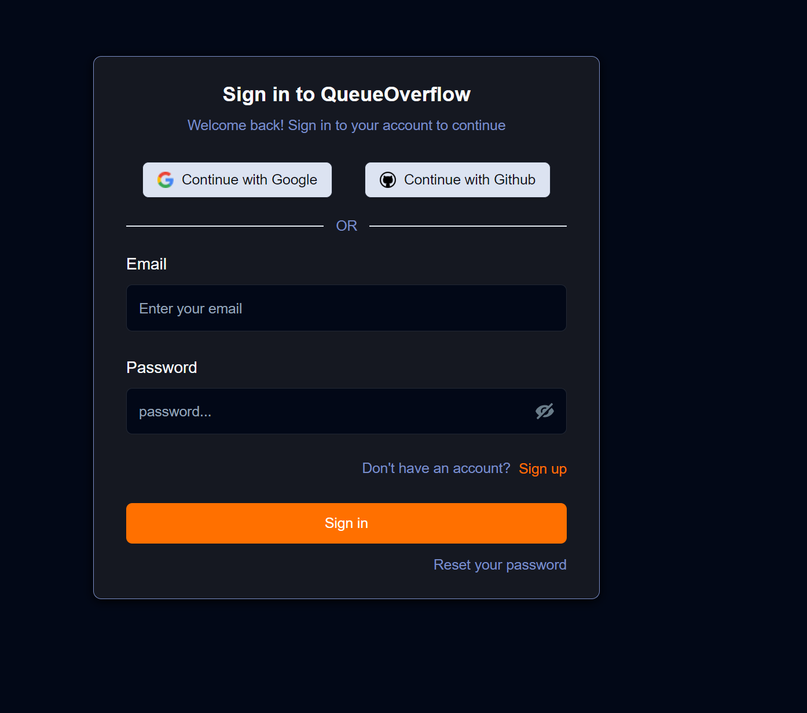
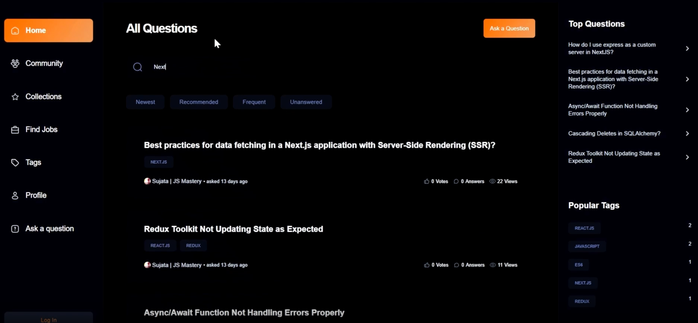
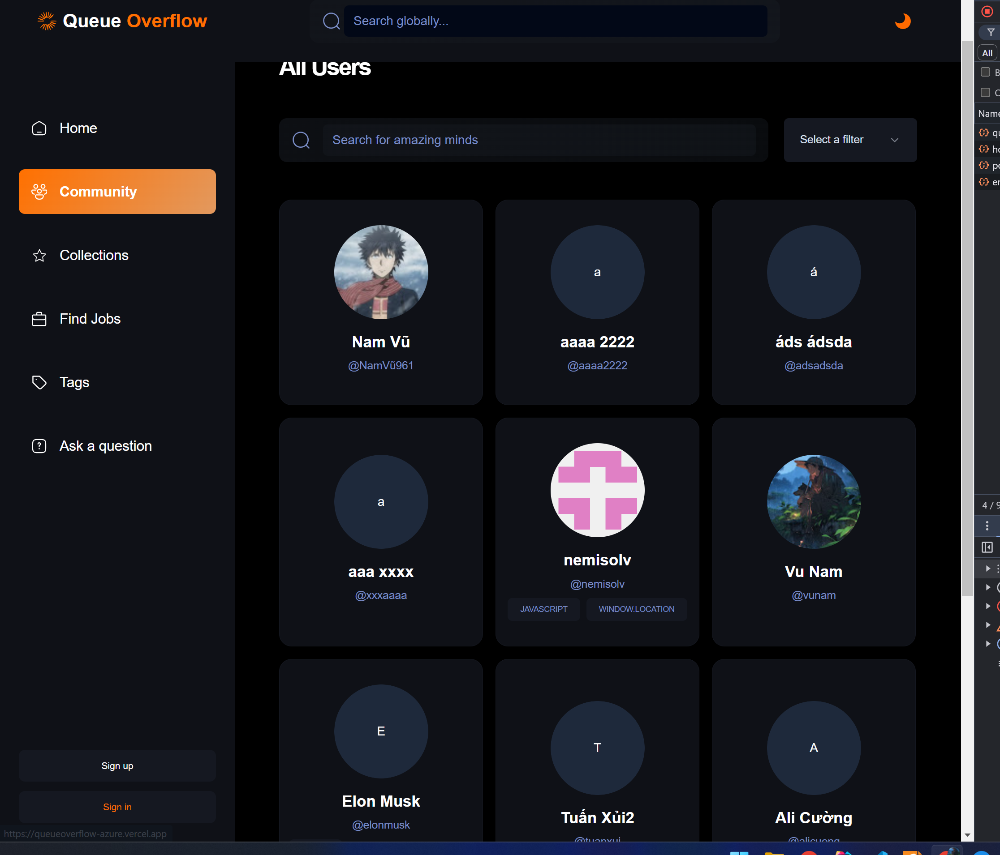
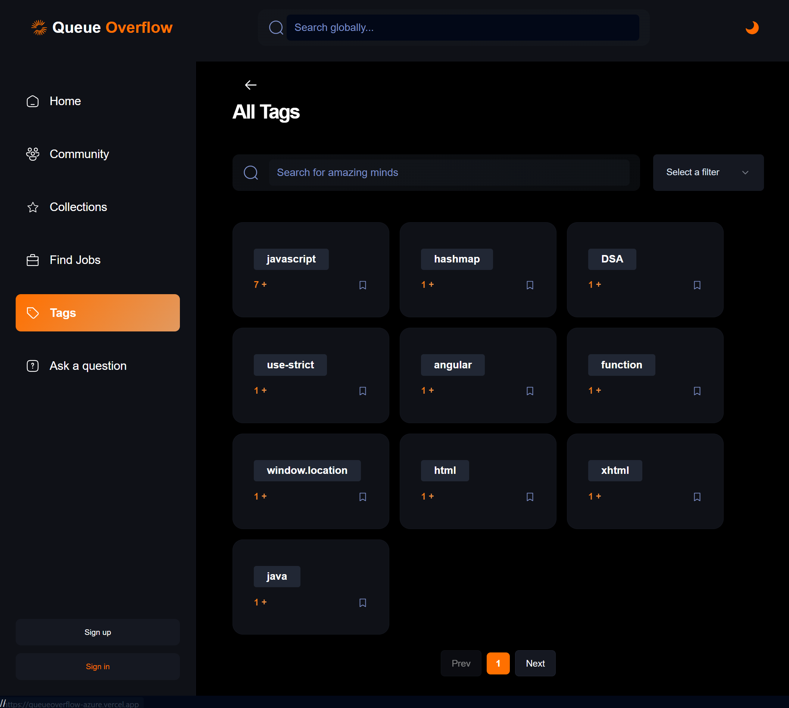

<h1 align="center" style="font-weight: bold;">Queue Overflow Clone 💻</h1>

<p align="center">
 <a href="#technologies">Technologies</a> • 
 <a href="#getting-started">Getting Started</a>  
</p>

<p align="center">
    <b>Developed a fully responsive Queue Overflow clone with features for managing questions and answers, upvoting, user connections, global search, two-factor authentication (2FA), and dark mode.</b>
</p>

<p align="center">
     <a href="queueoverflow-azure.vercel.app">📱 Visit this Project</a>
</p>

<h2 id="layout">🎨 Layout</h2>

<figure style="display: flex; flex-direction: column; row-gap: 20px">
  
  
  
  
</figure>

<h2 id="technologies">💻 Technologies</h2>

- React
- Tailwind CSS
- Java Spring Boot
- Typescript
- Redux Saga

<h2 id="getting-started">🚀 Getting Started</h2>

Follow these steps to run the project locally.

<h3>Prerequisites</h3>

Ensure you have the following installed:

- Java JDK
- Node.js

<h3>Cloning</h3>

Clone the repository:

```bash
git clone https://github.com/nemisolv/queueoverflow
